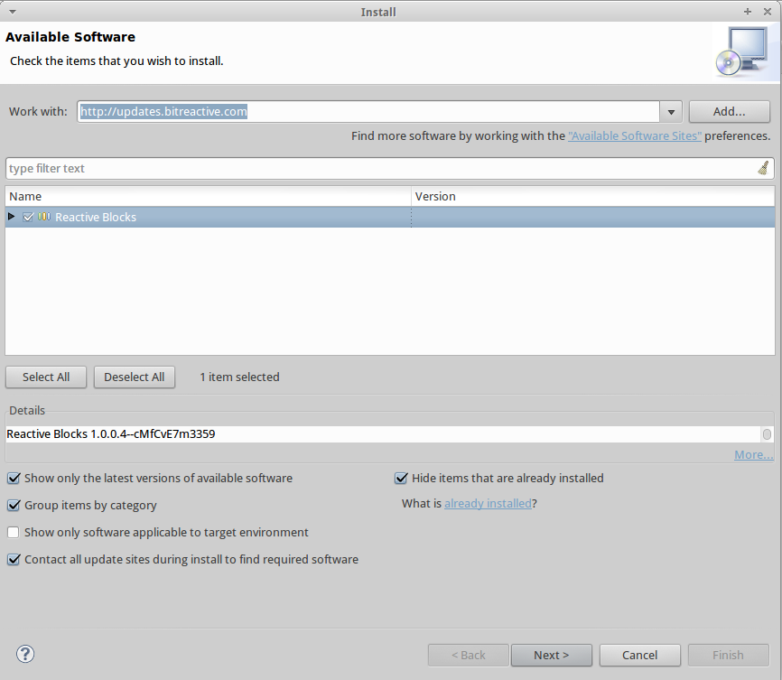

Reactive Blocks Tutorial Game
=============
This is a tutorial game for learning how to use UML Activities in [Reactive Blocks](http://www.bitreactive.com/). It was made as part of my Master's Thesis at [NTNU](http://www.ntnu.no/), which is about learning how to use software modeling languages.

**Note:** Most of the artwork in this game is not originally made by me, but comes from various free sources (for non-commercial use).

#How to play this game
Because of the nature and purpose of this game, it is controlled and played in a fairly untraditional way. Please follow these steps to get started.

##Requirements
- Eclipse Kepler 4.3
- A [Reactive Blocks license](http://www.bitreactive.com/)

##Setting up

######[Install Eclipse Kepler 4.3](http://www.eclipse.org/downloads/)
######[Sign up for Reactive Blocks](http://www.bitreactive.com/)
######Install the Reactive Blocks Eclipse plugin
- Open the "Install new software" window 
- Type in *http://updates.bitreactive.com*
- Select Reactive Blocks 

