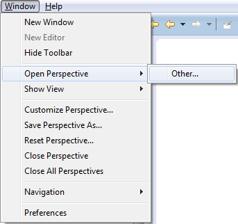
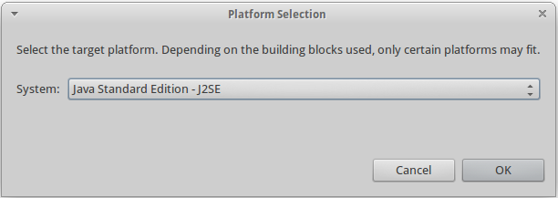

Reactive Blocks Tutorial Game
=============
This is a tutorial game for learning how to use UML Activities in [Reactive Blocks](http://www.bitreactive.com/). It was made as part of my Master's Thesis at [NTNU](http://www.ntnu.no/), which is about learning how to use software modeling languages.

**Note:** Most of the artwork in this game is not originally made by me, but comes from various free sources (for non-commercial use).

#How to play this game
Because of the nature and purpose of this game, it is controlled and played in a fairly untraditional way. Please follow these steps to get started.

##Requirements
- Eclipse Kepler 4.3
- Java SE Development Kit 7 or greater
- A [Reactive Blocks license](http://www.bitreactive.com/)

##Setting up

######[Install Eclipse Kepler 4.3](http://www.eclipse.org/downloads/)
Make sure you have at least Java SE Development Kit 7 installed. To make Eclipse run with this JRE as default:
- Select "Window" => "Preferences"
- Under *Java*, select *Installed JREs*
- See if *jre7* is listed. If not, add it as a *Standard VM* (JRE home is the directory where it is installed).
- Check the box next to *jre7* to make it the default JRE.

######[Sign up for Reactive Blocks](http://www.bitreactive.com/)

######Install the Reactive Blocks Eclipse plugin
- Open the "Install new software" window

- Type in *http://updates.bitreactive.com*
- Select Reactive Blocks and click "Next"

- Accept the license agreement and finish
- Restart Eclipse when the installation has finished

######Open the Reactive Blocks perspective
- Select "Window", "Open Perspective" and "Reactive Blocks"

- If Reactive Blocks is not listed, select "Other". It should be in this extended list.

######Clone this repository into your workspace
Using your favourite Git front-end (Egit, Git Shell, Git for Windows etc...), clone the whole repository.

######Import the *no.ntnu.oyvinric.tutorialgame.release* project into your workspace
- Select "File" and "Import"
- Under "General", select "Existing Projects into Workspace"

- Click "Browse" with the "Select root directory" option, and find the *no.ntnu.oyvinric.tutorialgame.release* folder.
- Click "Finish". The project should now appear both in *Package Explorer* and under *Blocks* => *Projects*

##Getting started
You should start by taking a look at the introduction for level 1. In the project view under *Blocks*, you should see a building block called *Level1_Introduction*. This is a Reactive Blocks application that simply displays the introduction window.

In order to see the window, you need to *build* and *run* the block. This process also needs to be repeated for every level you complete, and every new introduction.

######Build
- Right click the *Level1_Introduction* building block, and choose "Select Build Target Platform" under "Build"
- You may have to sign in to Reactive Blocks at this point. If you haven't already registered, you can do it now. When you have signed in, you need to right click the block and choose "Select Build Target Platform" again.
- Choose *Java Standard Edition - J2SE*

- Click OK without changing any parameters in the next window

When building has finished, you should see a new project under *Package Explorer* called *no.ntnu.oyvinric.tutorialgame.release.level1_introduction.exe*. This is a project with executable code.

######Run
- Right click the new project and select "Run As" and "Java Application"
- Find the type called *Start - no.ntnu.oyvinric.tutorialgame.release.level1_introduction* and click "Next"

A window should pop up, with various information elements and buttons. Watch the slideshow to learn how to play the game!

